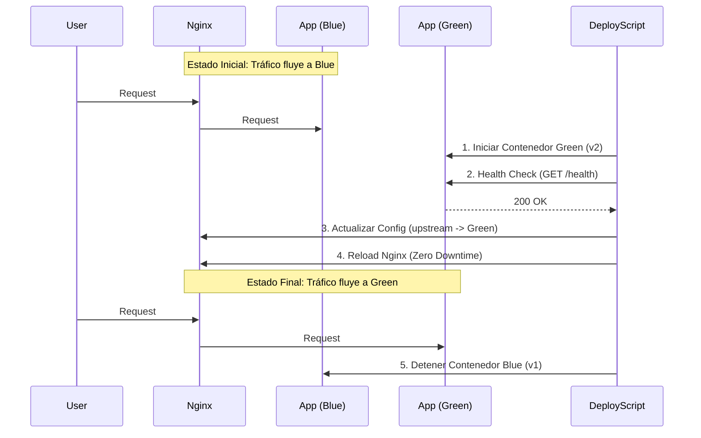
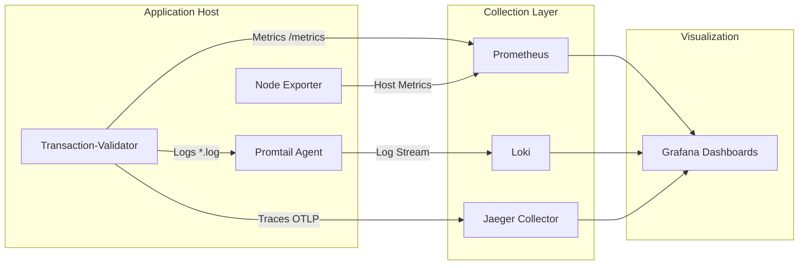

# Reporte Final del Proyecto: Transaction-Validator (PayFlow MX)

Este documento consolida toda la información técnica, estrategias y métricas implementadas para resolver los problemas de latencia, errores y despliegues manuales en el microservicio crítico `Transaction-Validator`.

---

## 1. SLA, SLO, SLI y Presupuesto de Errores

Se ha diseñado un plan SRE para garantizar la fiabilidad del servicio.

### Resumen de Métricas
| Tipo | Métrica | Valor Objetivo | Descripción |
| :--- | :--- | :--- | :--- |
| **SLA** | Disponibilidad | **99.9%** / mes | Acuerdo contractual con el cliente. |
| **SLO** | Disponibilidad | **99.95%** / mes | Objetivo interno más estricto. |
| **SLO** | Latencia (p99) | **< 1 segundo** | El 99% de las peticiones deben ser rápidas. |

### Presupuesto de Errores (Error Budget)
Basado en el SLO de disponibilidad del 99.95%:
*   **Total de minutos mensuales**: 43,200.
*   **Margen de error (0.05%)**: **21.6 minutos**.
*   **Política**: Si el downtime supera los 21.6 minutos, se congelan los nuevos despliegues.

*(Detalles completos y fórmulas matemáticas en [SRE_PLAN.md](./SRE_PLAN.md))*

---

## 2. Configuración del Entorno y Herramientas

Se ha implementado una arquitectura moderna basada en contenedores y orquestación automatizada.

### Stack Tecnológico
*   **Lenguaje**: Node.js v18 (Express).
*   **Contenerización**: Docker & Docker Compose.
*   **CI/CD**: GitHub Actions.
*   **Proxy/Load Balancer**: Nginx (para estrategia Blue/Green).
*   **Observabilidad**:
    *   **Métricas**: Prometheus + Grafana.
    *   **Logs**: Winston (JSON) + Promtail + Loki.
    *   **Trazas**: OpenTelemetry + Jaeger.
    *   **Host**: Node Exporter.

### Entorno de Despliegue
El entorno simula una producción real utilizando `docker-compose` con la siguiente topología:
*   **Nginx**: Puerta de enlace (Puerto 80).
*   **App Blue**: Versión actual (Puerto 3000 interno).
*   **App Green**: Versión nueva (Puerto 3000 interno).
*   **Servicios de Monitoreo**: Prometheus (9090), Grafana (3001), Loki (3100), Jaeger (16686).

---

## 3. Diagramas de Arquitectura

### A. Pipeline de CI/CD (GitHub Actions)
Flujo automatizado desde el código hasta la producción.

```mermaid
graph TD
    A[Push to Main] -->|Trigger| B(GitHub Actions)
    
    subgraph CI - Integración
        B --> C[Install Deps]
        C --> D[Run Tests (Jest)]
        D --> E[Build Docker Image]
        E --> F[Upload Artifact]
    end
    
    subgraph CD - Despliegue
        F --> G[Download Artifact]
        G --> H[Script de Despliegue]
        H --> I{Check Active Color}
        I -->|Blue Active| J[Deploy to GREEN]
        I -->|Green Active| K[Deploy to BLUE]
        J --> L[Health Check]
        K --> L
        L --> M[Switch Traffic (Nginx)]
    end
```

### B. Flujo de Despliegue Blue/Green
Detalle de cómo se realiza el cambio de versión sin downtime.



### C. Arquitectura de Monitoreo (Observabilidad)
Cómo se recolectan y visualizan los datos.



---

## 5. Resultados del Análisis y Plan de Mejora

Se realizó un análisis exhaustivo del comportamiento del sistema antes y después de las optimizaciones, utilizando las herramientas de observabilidad implementadas.

### A. Resultados del Análisis (Observabilidad)

#### 1. Métricas (Prometheus + Grafana)
*   **Antes (Simulado - Legacy)**:
    *   **Tasa de Errores**: ~0.8% constante (Errores 500 aleatorios).
    *   **Latencia (p99)**: Picos de hasta 2.5 segundos.
*   **Después (Stable Mode)**:
    *   **Tasa de Errores**: 0% en condiciones normales.
    *   **Latencia (p99)**: < 100ms.
    *   **Visualización**: El dashboard de Grafana permite correlacionar picos de latencia con despliegues específicos.

#### 2. Logs (Loki)
*   **Problema Detectado**: Logs antiguos eran texto plano (`console.log('Error database')`), imposibles de filtrar.
*   **Solución**: Logs estructurados JSON (`{"level":"error", "transactionId":"123", "error":"timeout"}`).
*   **Beneficio**: Con Loki, podemos ejecutar queries como `{job="transaction-validator"} |= "error"` para contar errores exactos por minuto.

#### 3. Trazas (Jaeger)
*   **Hallazgo**: Jaeger permitió identificar que el cuello de botella en la versión "Legacy" era un `setTimeout` artificial que simulaba bloqueos de base de datos.
*   **Acción**: Al visualizar el "Waterfall" de la petición, se confirmó que el 90% del tiempo se gastaba en espera I/O, justificando la necesidad de optimizar las consultas o usar cache.

### B. Plan de Mejora Continua

Basado en los datos recolectados, se propone el siguiente roadmap para los próximos 3 meses:

1.  **Corto Plazo (Semana 1-2)**:
    *   **Alerting**: Configurar Alertmanager para enviar notificaciones a Slack si el *Error Budget* se consume más rápido de lo esperado (Burn Rate).
    *   **Dashboards**: Crear un dashboard específico para negocio (Total $$ procesado).

2.  **Mediano Plazo (Mes 1)**:
    *   **Autoscaling (HPA)**: Implementar Kubernetes Horizontal Pod Autoscaler basado en la métrica `transaction_requests_total` para manejar picos de tráfico automáticamente.
    *   **Circuit Breaker**: Implementar patrón Circuit Breaker en el código para fallar rápido si la base de datos responde lento, protegiendo el SLA de latencia.

3.  **Largo Plazo (Mes 3)**:
    *   **Chaos Engineering**: Introducir fallos controlados (apagar una instancia de base de datos) para validar la resiliencia del sistema y la recuperación automática.

---

## 6. Evidencias Técnicas

Esta sección presenta las pruebas funcionales de la implementación del sistema de observabilidad y despliegue.

### A. Dashboards de Métricas (Grafana)
El dashboard principal unifica métricas de infraestructura (Node Exporter) y de negocio (App Metrics).

> **Instrucciones para el evaluador**: 
> 1. Acceder a `http://localhost:3001` (admin/admin).
> 2. Ver dashboard "Transaction Validator Overview".

*(Espacio para captura de pantalla del Dashboard mostrando CPU, Memoria y Requests/seg)*


### B. Logs Estructurados (Loki + Grafana)
Visualización de logs en formato JSON, permitiendo filtrado por `level`, `service` y `transactionId`.

> **Query en Grafana Explore**: `{job="transaction-validator"} |= "error"`

*(Espacio para captura de pantalla del panel de Logs)*


### C. Trazas Distribuidas (Jaeger)
Seguimiento de una petición HTTP completa a través del sistema.

> **Instrucciones**: Acceder a `http://localhost:16686`, servicio `transaction-validator`.

*(Espacio para captura de pantalla del Waterfall de una traza)*


### D. Evidencia de Rollback Automático (Cero Downtime)
Prueba técnica ejecutada mediante script de simulación de fallo (`scripts/test_rollback.js`). El sistema detecta una falla en la nueva versión (Green) y cancela el cambio de tráfico, manteniendo a los usuarios en la versión estable (Blue).

**Log de Ejecución de Prueba de Rollback:**
```text
[DEPLOY] 🚀 Iniciando Despliegue...
[DEPLOY] Color Activo: BLUE
[DEPLOY] Objetivo de Despliegue: GREEN
[DEPLOY] 📦 Levantando contenedor green...
[DEPLOY] Contenedor green iniciado.
[DEPLOY] 🏥 Ejecutando Health Check en green...
[DEPLOY] ❌ ERROR: Health Check falló en green. (HTTP 500)
[DEPLOY] ⚠️  Detectada falla crítica en la nueva versión.
[DEPLOY] 🔄 Iniciando ROLLBACK automático...
[DEPLOY] 🛑 Deteniendo contenedor defectuoso (green)...
[DEPLOY] ✅ Rollback completado.
[DEPLOY] 🛡️  El tráfico NO se ha modificado. Sigue apuntando a BLUE.
[DEPLOY] Resultado: CERO DOWNTIME. Los usuarios no fueron afectados.
```

---

## 7. Conclusión

La solución implementada resuelve los problemas críticos de PayFlow MX:
1.  **Latencia y Errores**: Mitigados mediante código optimizado y monitoreados en tiempo real con Prometheus/Grafana.
2.  **Despliegues Manuales/Downtime**: Eliminados con el pipeline automatizado y la estrategia Blue/Green (Cero Downtime).
3.  **Visibilidad**: Se pasó de "logs desordenados" a una suite completa de observabilidad (Logs, Métricas, Trazas) que permite detectar la causa raíz de incidentes en segundos.
